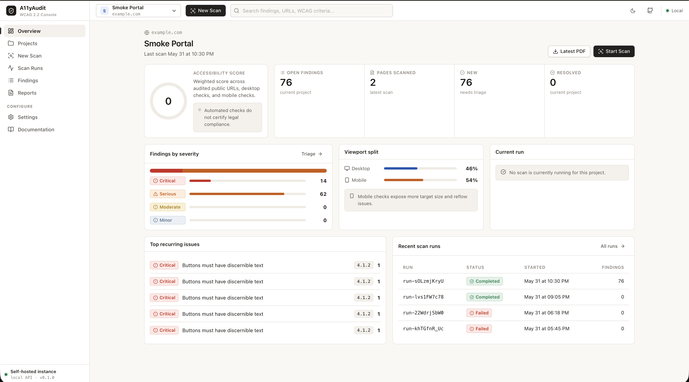

# A11yAudit

A11yAudit is an Apache-2.0 licensed, open-source, self-hosted WCAG 2.2 technical accessibility audit platform.

It crawls public websites, runs automated accessibility checks in real browser contexts, captures evidence, and generates technical HTML/PDF reports that engineering teams can use to fix accessibility issues before they become institutional risk.



## Why Accessibility Matters

The web is public infrastructure. People use websites to access government services, banking, commerce, education, healthcare, employment, transportation, news, and daily communication. If a website cannot be used with a keyboard, screen reader, magnification, sufficient contrast, predictable focus order, or accessible controls, part of the public is effectively excluded from that service.

Accessibility is not only a design preference. It affects:

- Equal access for disabled users.
- Public-service quality and institutional trust.
- Search, usability, mobile ergonomics, and product quality.
- Legal, procurement, and compliance readiness.
- Engineering maintainability, because accessible interfaces usually have clearer semantics and better structure.

Automated testing cannot replace human judgment, but it can catch many high-impact technical failures early and repeatedly.

## Why WCAG 2.2 Matters

WCAG, the Web Content Accessibility Guidelines, is the most widely used international reference for accessible digital experiences. WCAG 2.2 builds on WCAG 2.1 and keeps the core POUR model:

- **Perceivable**: users must be able to perceive content through available senses and assistive technologies.
- **Operable**: users must be able to operate the interface with different input methods, including keyboard-only use.
- **Understandable**: users must be able to understand the content, controls, labels, flows, and errors.
- **Robust**: content must work reliably with browsers, assistive technologies, and future user agents.

WCAG 2.2 is especially important because it strengthens expectations around focus visibility, target size, dragging alternatives, consistent help, redundant entry, and accessible authentication. These are practical issues that affect real users on real devices, especially mobile and keyboard users.

A11yAudit focuses on automated, technical verification of WCAG-related failures. It does not claim to fully certify WCAG conformance because many WCAG success criteria require manual review, user-context analysis, content judgment, or assistive-technology testing.

## What A11yAudit Does

A11yAudit provides a self-hosted audit workflow for teams that need repeatable accessibility checks without sending target data to a third-party hosted service. The web app now uses accounts and workspace-scoped project data, while the CLI remains an offline, account-free scanner.

Current capabilities:

- Create projects for public HTTP/HTTPS website targets.
- Run single URL audits.
- Run same-domain full-site crawls with page and depth limits.
- Audit both desktop and mobile viewports.
- Execute checks in Playwright Chromium.
- Run axe-core-based accessibility rules and project custom checks.
- Block localhost, private networks, and unsafe scan targets.
- Respect crawler safety limits and robots.txt behavior.
- Capture page screenshots for findings.
- Capture HTML snippets for technical evidence.
- Persist projects, scan runs, findings, reports, and evidence in a local instance.
- Generate HTML and PDF reports.
- Download report artifacts and finding evidence from the web UI.
- Use the same scan options from CLI and Web UI.

## What It Does Not Do

A11yAudit is intentionally honest about the boundary of automation.

It does not:

- Certify legal compliance.
- Prove full WCAG 2.2 conformance.
- Replace manual screen reader testing.
- Replace keyboard-only exploratory testing.
- Audit authenticated user journeys.
- Solve content-policy or editorial accessibility issues automatically.
- Guarantee that a website is accessible to every user after automated checks pass.

The goal is technical verification, evidence collection, and institutional-grade reporting, not false certification.

## Product Overview

A11yAudit has three operator surfaces:

- **Web UI**: project management, scan creation, scan monitoring, findings, evidence, and report downloads.
- **CLI**: local scan execution for automation, CI, and direct technical use.
- **Server API**: authenticated self-hosted API for workspace-scoped projects, scans, findings, issues, reports, and artifacts.

The web UI and CLI support the same core scan profile:

- `single_url`
- `same_domain_crawl`
- `maxPages`
- `maxDepth`
- `desktop`
- `mobile`

## Monorepo Structure

```text
apps/
  web/       React web UI
  server/    Fastify API, SQLite persistence, local worker
  cli/       Command-line scanner

packages/
  audit/     Shared scan orchestration
  core/      Shared models, defaults, WCAG metadata
  crawler/   Same-domain crawler, robots, URL normalization, network safety
  rules/     Playwright/axe/custom rule execution
  reporter/  HTML and PDF report generation
  storage/   Local artifact storage
```

## Quickstart

### Requirements

- Node.js `>=20.11`
- pnpm `>=9`
- Playwright Chromium dependencies

If pnpm is not installed globally, use Corepack:

```bash
corepack enable
corepack prepare pnpm@9.15.9 --activate
```

Install dependencies:

```bash
pnpm install
```

Install Playwright Chromium:

```bash
pnpm exec playwright install --with-deps chromium
```

## Run the Web UI

Start the API:

```bash
pnpm --filter @a11yaudit/server dev
```

Start the web UI:

```bash
VITE_A11YAUDIT_API_BASE_URL=http://localhost:7842 pnpm --filter @a11yaudit/web dev
```

Open:

```text
http://localhost:5173
```

The API runs on:

```text
http://localhost:7842
```

Health check:

```bash
curl http://localhost:7842/health
```

### Bootstrap a Workspace

A fresh web deployment assumes an empty SQLite database for the current SaaS schema.

1. Start the server with an empty SQLite database.
2. Open `/signup`.
3. The first account creates the first workspace and becomes its owner.
4. After that, set `A11YAUDIT_PUBLIC_SIGNUPS=true` if open signup is intended, or invite users from an existing workspace.

By default, public signup is closed after the first user. See [Deployment Notes](docs/deployment.md) for environment variables and operational boundaries.

## Run with Docker Compose

```bash
docker compose up
```

Then open:

```text
http://localhost:5173
```

## CLI Usage

Single URL scan:

```bash
pnpm --filter @a11yaudit/cli dev -- scan https://example.com \
  --pdf \
  --out .a11yaudit-example \
  --mode single-url
```

Same-domain crawl:

```bash
pnpm --filter @a11yaudit/cli dev -- scan https://example.com \
  --pdf \
  --out .a11yaudit-example \
  --mode same-domain-crawl \
  --max-pages 25 \
  --max-depth 2
```

Desktop-only:

```bash
pnpm --filter @a11yaudit/cli dev -- scan https://example.com \
  --out .a11yaudit-example \
  --mode single-url \
  --no-mobile
```

Mobile-only:

```bash
pnpm --filter @a11yaudit/cli dev -- scan https://example.com \
  --out .a11yaudit-example \
  --mode single-url \
  --no-desktop
```

CLI output includes:

- HTML report
- PDF report
- Screenshot evidence
- HTML snippet evidence

CLI scans remain local, offline, and account-free. They do not require web sign-in, workspace membership, or a SaaS account.

## Scan Modes

### Single URL

Audits only the submitted URL, using the selected viewports.

Use this for:

- A specific landing page.
- A known problematic page.
- Regression testing after a targeted fix.
- Fast local checks.

### Same-Domain Crawl

Starts from the submitted URL, discovers same-origin links, and audits discovered pages up to configured limits.

Use this for:

- Public website sweeps.
- Institutional site checks.
- Finding recurring template-level issues.
- Comparing desktop and mobile accessibility behavior.

The crawler applies:

- same-origin filtering
- URL normalization
- duplicate avoidance
- unsafe network target blocking
- robots.txt handling
- page count limits
- crawl depth limits
- navigation timeouts
- HTML size limits

## Evidence Model

Each technical finding can include:

- WCAG criteria
- severity
- rule ID
- selector
- page URL
- viewport
- number of instances
- HTML snippet artifact
- page screenshot artifact
- rule documentation URL when available

The web UI exposes evidence from finding detail pages. Reports are available from the Reports page.

### Issue Grouping

A11yAudit distinguishes grouped accessibility issues from raw occurrences. A repeated header, footer, sidebar, or CMS widget problem is shown as one unique issue with affected page and occurrence counts, instead of thousands of duplicate rows. Raw occurrences remain available for technical traceability.

### Rule Engines

A11yAudit combines axe-core checks with custom Playwright interaction rules. axe-core covers many static WCAG technical checks. Interaction rules exercise keyboard and focus behavior, including keyboard-reachable clickable controls, visible focus indicators, obscured focus targets, and suspected keyboard traps. Interaction findings are technical signals and may require manual confirmation.

## API Overview

The old global web API endpoints such as `/api/projects` and `/api/scans` have been replaced by authenticated, workspace-scoped endpoints. Main local endpoints:

```text
GET  /health
POST /api/auth/signup
POST /api/auth/login
POST /api/auth/logout
GET  /api/auth/session
GET  /api/workspaces
GET  /api/workspaces/:workspaceSlug
GET  /api/workspaces/:workspaceSlug/projects
POST /api/workspaces/:workspaceSlug/projects
GET  /api/workspaces/:workspaceSlug/scans
POST /api/workspaces/:workspaceSlug/scans
GET  /api/workspaces/:workspaceSlug/findings
GET  /api/workspaces/:workspaceSlug/issues
GET  /api/workspaces/:workspaceSlug/reports
GET  /api/workspaces/:workspaceSlug/reports/:reportId/download
GET  /api/workspaces/:workspaceSlug/artifacts/download?key=...
```

Example scan payload:

```json
{
  "projectId": "proj_123",
  "url": "https://example.com",
  "mode": "same_domain_crawl",
  "maxPages": 25,
  "maxDepth": 2,
  "viewports": ["desktop", "mobile"]
}
```

## Development

Run tests:

```bash
pnpm test
```

Run type checks:

```bash
pnpm typecheck
```

Build all packages:

```bash
pnpm -r build
```

## Linux and Playwright

A11yAudit uses Playwright Chromium for:

- page rendering
- JavaScript execution
- viewport-specific audits
- screenshots
- PDF generation

On Linux servers, install Playwright browser dependencies:

```bash
pnpm exec playwright install --with-deps chromium
```

In containerized deployments, ensure Chromium dependencies and sandbox requirements are handled by the image.

## Security Boundary

A11yAudit is designed to scan public websites. It blocks:

- localhost targets
- loopback IPs
- private IP ranges
- link-local addresses
- unsupported protocols
- unsafe redirects outside the requested origin

This is important because scanners fetch user-provided URLs. URL fetching must be treated as an SSRF-sensitive operation.

See [SECURITY.md](SECURITY.md).

## Reporting Boundary

A11yAudit reports are technical audit artifacts. They are useful for engineering, QA, procurement readiness, and accessibility remediation planning.

They are not:

- legal opinions
- compliance certificates
- full manual audits
- substitute reports for assistive-technology testing

Use A11yAudit as one layer in an accessibility program.

## License

Apache-2.0. See [LICENSE](LICENSE).
